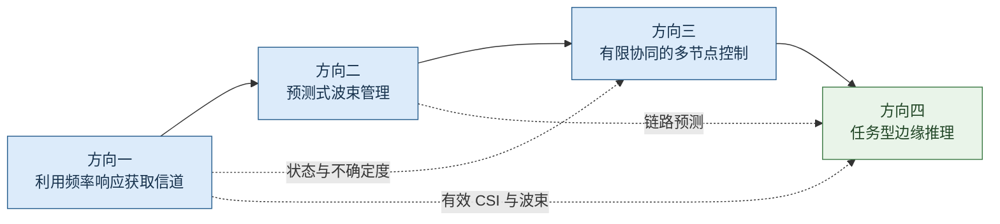

# AI Edge 赋能太赫兹 DMA/RHS 研究路线总纲

本文档规定研究主线、四个方向的逻辑关系和选题判据。概念与符号见 [公共模型](01_AI_Edge与太赫兹DMA_RHS的概念和公共模型.md)，文献证据见 [文献地图](02_文献地图与研究现状比较框架.md)。

## 1. 总体研究判断

本路线的核心对象是**受真实物理约束的太赫兹超表面收发机控制**。AI Edge 提供信道推断、状态预测、分布式协调和任务资源编排能力；DMA/RHS 提供低射频链、低维观测和可编程孔径。两者结合后的研究价值取决于 AI 是否解决了超表面架构特有的通信问题，而不是是否使用了某种神经网络。

四个方向可形成以下功能闭环；这表示输入输出关系，不规定论文完成顺序：

1. 从少量导频和可实现表面状态中获取当前通信状态。
2. 根据历史观测预测移动、阻塞和波束失配，提前更新表面状态。
3. 多个边缘节点在有限协调开销下联合控制 DMA/RHS，处理跨节点干扰和用户服务。
4. 将通信状态和表面控制接入边缘推理任务，联合分配传输、计算和任务资源。

## 2. 已确认的研究边界

研究采用理论分析和仿真验证，不把以下内容作为博士主线：

- 太赫兹器件制作、射频测试和依赖自建硬件的验证；
- 以收发端实测和数据拟合为主要贡献的太赫兹信道建模；
- 透明超表面的逆向设计；
- 以 ISAC 为主要场景（但是可以接受作为一个次要的场景或者创新点）；
- 需要超出 RTX 5070 或 2×RTX 3090 才能完成的训练规模。

离线训练、在线输出信道估计、波束或表面权重的模型属于本路线接受的 AI Edge 范围。论文仍需明确训练位置、推理位置和输出进入配置闭环的方式。

## 3. 四个方向的研究位置

| 方向 | 要解决的具体矛盾 | AI Edge 的作用 | 主要可验证结果 | 当前定位 |
|---|---|---|---|---|
| 1. 利用 DMA 频率响应的宽带信道估计 | 固定或少量配置下，多子载波观测能否替代部分时间扫描 | 结构化估计、配置选择与可选轻量学习 | 训练符号、导频 RE、切换、获取时延、NMSE 与有效速率 | 当前优先细化，首篇顺序未定 |
| 2. 预测式波束管理 | 移动和人体阻塞使窄波束在更新完成前失效 | 时序状态预测、不确定度估计、主动探测和多步控制 | 中断时长、有效吞吐、尾时延、训练开销 | 与方向一连续 |
| 3. 分布式多用户控制 | 多接入点局部观测不足，完整 CSI 交换又超过前传预算 | 学习型量化消息、图结构控制、双时间尺度决策 | 5% 用户速率、协调比特、推理时延、拓扑泛化 | 第二阶段扩展 |
| 4. 任务型边缘推理 | 中间特征的重要性、链路状态和边缘计算负载相互耦合 | 切分选择、特征保护、资源编排和任务损失优化 | 准确率、尾时延、能耗、传输量 | AI Edge 应用分支 |

## 4. 统一科学问题

四个方向共享一个可检验问题：**当太赫兹 DMA/RHS 的可实现观测和控制状态受频率响应、馈电传播、有限调谐及低射频链约束时，能否利用数据与模型结合的方法，以更低的通信和计算开销完成可靠状态推断与控制？**

这一问题可拆为四类假设：

- **H1，频域观测价值。** 在固定业务频段、RF 链、导频资源与能量条件下，利用可实现 DMA 频率响应和共享路径结构，能否减少时间扫描或配置切换，并保持通信性能。更少符号不自动等于更少导频，收益须扣除损耗、保护和校准成本。
- **H2，预测价值。** 当阻塞或波束失配具有可观测前兆时，预测式更新比增益阈值触发更新减少连续失联时间。
- **H3，协调信息价值。** 在固定前传比特数下，任务学习得到的协调消息比固定 CSI 摘要保持更高的边缘用户速率。
- **H4，任务联合设计价值。** 在链路和计算负载变化时，联合选择切分、特征保护和表面状态比通信与计算分离设计降低任务尾时延。

每个假设都应给出适用区间和失效区间。若收益只来自更大模型或更多先验信息，不构成超表面通信层面的有效结论。

## 5. 建议的研究顺序

### 5.1 第一阶段：建立物理与算法底座

当前优先细化方向一，但不要求它成为首篇论文。先用 LoS 或 LoS + 单反射的候选模型，检验真实 DMA 频响在固定业务频段内能否减少顺序扫描，再比较结构化估计与训练设计。近/混合场和失配按需加入；不以完成复杂交互下界或训练网络作为起步条件。公共信道、表面响应和评价模块可以被其他方向直接复用。

### 5.2 第二阶段：加入时间演化

方向二可使用方向一的路径参数、有效 CSI 或波束后验，也可先使用现有估计器或约定误差模型，不必等待方向一成文。预测器不直接依赖摄像头或雷达，输入限制为通信导频、历史波束、ACK 和吞吐反馈。先做状态空间模型与模型预测控制，再判断强化学习是否带来额外收益。

### 5.3 第三阶段：扩展到多节点

方向三复用方向一的低维状态和方向二的不确定度，将单站控制扩展到 cell-free 或用户中心网络。重点研究显式比特预算下的协调消息，不重复已有的集中式联合波束或一般分布式优化。

### 5.4 第四阶段：形成 AI Edge 服务闭环

方向四把通信状态、预测结果和表面控制接入分割推理。它适合成为扩展论文或博士后期综合工作。若物理层变量只作为固定速率公式，研究会退化为一般边缘计算，应收缩方向四并保持前三个方向为主线。

## 6. 阶段门槛与停止条件

2026-09-14 执行状态：D-024 的 300 GHz 随机波束中心自适应局部网格诊断已完成 100 个条件场景和 1200 行。F2 在局部细采样后消除了旧粗网格触发的距离伪峰，OMP/Yang 在 55/65 dB 均达到 100% 的全带 NMSE≤−10 dB；F1 Yang 只有 63%/67%，剩余失败主要是局部窗内约 1–2°角度竞争峰，且提高 SNR 不能消除。该结果仍依赖每径一个观测前粗中心，不能代替未知全局几何获取或正式方法排名。当前不扩大全局字典，也不启动正式配置和新文献方法；下一步建议先分解 F1 单径/三径角度歧义。具体结果见 [19 号文档](19_方向一Stage2A固定扇区诊断与下一验证.md)第 13 节与 D-025。

| 阶段 | 进入下一阶段前的门槛 | 调整或停止条件 |
|---|---|---|
| 方向一观测价值 | 现实模型与基线可复现；频域观测在统一资源下表现出可解释的训练价值 | 频响近似比例变化、损耗抵消信息收益，或只有增加资源才获得改善 |
| 方向一算法与训练 | 同等通信性能下降低获取成本，或同等资源下稳定改善性能 | 收益只来自错误模型基线、额外校准先验或忽略切换；经典算法已满足需求则不强加网络 |
| 方向二预测 | 阻塞或失配前存在可校准的预测信号 | 阻塞过程近似不可预测，预测控制不优于阈值触发 |
| 方向三协调 | 有限比特协调在重叠覆盖区域形成稳定收益 | 学习消息与简单干扰标量交换无显著差异 |
| 方向四任务 | 联合设计在尾时延或准确率—时延曲线上形成帕累托改进 | 结果主要由神经网络压缩贡献，表面物理控制无实质作用 |

## 7. 预期论文组合

以下为候选论文主题，不预定篇数与顺序：

1. **利用 DMA 频率响应的低开销宽带信道估计**：将观测条件、结构化恢复与少切换训练作为一条贡献链，先验证是否有净资源收益。物理分析不预先单独拆成论文。
2. **预测控制**：利用通信侧历史观测完成阻塞或波束有效性预测，联合主备波束与训练时刻。
3. **分布式或任务型综合工作**：根据通信收益与验证成本选择多节点协调或任务型边缘推理。

## 8. 当前未确认的设计选择

以下内容属于当前建议，尚未成为固定约束：

- 方向一从“单用户、上行 OFDM、基站侧接收 DMA”开始；
- 首篇论文选信道估计还是波束管理，以及四方向的实际推进顺序；
- 方向一主输出选路径/重构 CSI、有效 CSI 还是直接波束；
- 传统参数化、SBL、张量方法与轻量学习的取舍；
- 导频子载波、共享偏置和切换时序的具体联合设计方法。

这些选择及其变更记录在 [99_研究决策记录.md](99_研究决策记录.md)。
