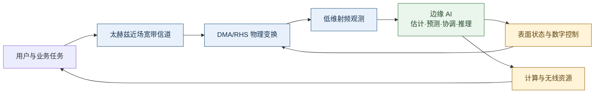

# AI Edge 与太赫兹 DMA/RHS 的概念和公共模型

本文档统一概念、系统边界和符号。各研究方向在此模型上删减变量，不另行改变 AI Edge、DMA 或 RHS 的基本口径。

## 1. AI Edge 的工作定义

[杨婷婷等@2025，《中国科学：信息科学》](https://doi.org/10.1360/SSI-2025-0344)将 AI Edge 描述为面向智能应用的移动信息服务基础设施，其基础是开放、可编程、统一的异构算力架构，功能覆盖移动边缘信息服务、网络功能虚拟化以及网络内生 AI 与自治。

本研究采用宽口径：只要 AI 模型服务于 DMA/RHS 通信链路，并在端、边缘节点或网络控制器执行在线推理，就可以称为 AI Edge 赋能。离线训练不影响这一归类。每项工作必须交代以下三个位置关系：

| 必答问题 | 可接受答案示例 |
|---|---|
| 模型在哪里训练 | 工作站离线训练、边缘服务器周期微调、多个节点联邦训练 |
| 模型在哪里执行 | 基站边缘服务器、接入点控制器、终端侧轻量模型 |
| 输出如何进入闭环 | 输出 CSI、路径参数、波束索引、DMA/RHS 权重、训练触发或资源决策 |

由此形成三个层次：

- **AI 辅助层**：模型根据导频或状态输出估计量和控制量。
- **边缘闭环层**：模型在信道或业务时限内完成推理并触发配置更新。
- **基础设施协同层**：多个边缘节点联合分配算力、交换控制信息并协调表面状态。

方向一可以停留在 AI 辅助层和边缘闭环层；方向三、四更接近基础设施协同层。

## 2. DMA、RHS 与相邻概念

| 名称 | 本文采用的结构特征 | 在通信模型中的核心约束 |
|---|---|---|
| DMA | 多个亚波长可调辐射单元沿微带或波导馈电，每条馈线连接少量射频链 | 导波传播、谐振幅相耦合、低维射频接口、频率选择性、互耦 |
| RHS | 通过参考波与目标波的干涉关系调节辐射幅度或状态，形成全息波束 | 幅度或离散控制、参考波传播、有限馈源、空间耦合 |
| H-MIMO | 强调连续或超密集可编程孔径的系统级概念 | 近场、空间非平稳、物理孔径与自由度 |
| RIS | 通常作为无源反射或透射中继，不直接构成有源收发机射频接口 | 级联信道、被动相位或幅相约束 |
| SIM | 多层透射超表面完成波域计算 | 层间传播、透射系数、多层结构 |

本路线聚焦**收发机型 DMA/RHS**。RIS 和 SIM 文献只在算法或任务模型可迁移时作为相邻证据，不把其硬件模型直接替换为 DMA/RHS。

## 3. 公共系统结构

考虑 $B$ 个边缘接入节点、$U$ 个用户和 $K$ 个 OFDM 子载波。第 $b$ 个节点配置 $N_b$ 个超表面单元和 $N_{\mathrm{RF},b}$ 条射频链，通常有 $N_{\mathrm{RF},b}\ll N_b$。边缘节点承载估计、预测、协调或任务推理模块。

## 4. 公共观测模型

以第 $t$ 个含导频的 OFDM 符号、第 $k$ 个子载波的上行接收为例。此处 $t$ 不直接等同于协议时隙，也不代表一个新的 DMA 配置：

$$
\mathbf y_{b,t,k}
=\mathbf W_b(\mathbf u_{b,t},f_k;\boldsymbol\eta_b)
\sum_{i=1}^{U}\mathbf h_{b,i,k}x_{i,t,k}
+\mathbf n_{b,t,k}.
$$

$\mathbf u_{b,t}$ 是表面实际调谐量或偏置，$\boldsymbol\eta_b$ 汇集波导损耗、谐振参数、互耦近似和制造偏差。$\mathbf W_b\in\mathbb C^{N_{\mathrm{RF},b}\times N_b}$ 是由同一组物理偏置在频率 $f_k$ 上诱导的模拟变换。为区分单元调谐和馈电传播，可写成

$$
\mathbf W_b(\mathbf u_{b,t},f_k;\boldsymbol\eta_b)
=\mathbf Q_b(\mathbf u_{b,t},f_k)\mathbf G_b(f_k;\boldsymbol\eta_b).
$$

$\mathbf Q_b$ 表示单元可调响应，$\mathbf G_b$ 表示馈电传播、互耦和固定结构响应。各子载波共享同一组偏置 $\mathbf u_{b,t}$，不能把 $\mathbf W_b$ 当作可逐子载波独立设计的矩阵。同一配置可以跨多个符号保持。方向一另外区分系统子载波数 $K$、导频子载波数 $K_p$、不同配置数 $J$ 和实际切换次数 $N_{\mathrm{sw}}$；带宽用 $B_{\mathrm w}$，不占用接入节点数 $B$ 的符号。

频率采样增加的是观测样本，不自动增加独立信息。跨子载波恢复依赖共享的有限维路径结构、可知或可校准的表面响应，以及噪声白化后足够不同的有效投影。

## 5. 公共太赫兹近场宽带信道

第 $i$ 个用户到第 $b$ 个节点的子载波信道可表示为

$$
\mathbf h_{b,i,k}
=\sum_{\ell=1}^{L_{b,i}}
\rho_{b,i,\ell}(f_k)\alpha_{b,i,\ell}
e^{-j2\pi f_k\tau_{b,i,\ell}}
\mathbf a_b(f_k,r_{b,i,\ell},\theta_{b,i,\ell},\phi_{b,i,\ell}).
$$

该表达同时保留距离、角度、时延和频率相关路径增益。LoS 与反射路径可分别处于近场或远场，形成混合场模型。研究中按以下阶梯增加复杂度：

| 层级 | 信道与表面因素 | 用途 |
|---|---|---|
| M0 | 频率不变理想合并器、远场窄带 | 检查算法基本实现 |
| M1 | 太赫兹 OFDM、近场或混合场阵列响应 | 量化球面波和波束偏移 |
| M2 | M1 + 波导衰减、谐振频响和幅相耦合 | 建立物理约束主模型 |
| M3 | M2 + 有限调谐、互耦近似和参数失配 | 检验鲁棒性与迁移 |

上述阶梯用于因素管理，不要求每项研究都按顺序纳入全部因素。方向一可先用远场或近场单径、少反射的真实频响模型检验训练资源价值，再研究混合场与失配；近场—频散交互不是所有算法研究的先决条件。

## 6. 表面可实现性

DMA 单元常以受谐振机理约束的幅相响应建模。具体参数化可按所采用硬件模型确定，但算法输出必须经过可实现映射 $\Pi_{\mathcal U}(\cdot)$：

$$
\mathbf u_{b,t}=\Pi_{\mathcal U}(\widetilde{\mathbf u}_{b,t}),
$$

其中 $\mathcal U$ 可以是洛伦兹响应集合、有限状态码本或带调谐范围的连续集合。报告结果时同时给出理想连续上界和物理可实现结果，二者的差距是研究结论的一部分。

## 7. 三类时间尺度

| 时间尺度 | 典型变量 | 对应方向 |
|---|---|---|
| 快时间尺度 | 数字预编码、有效 CSI、短时表面状态、重传 | 方向一、二 |
| 中时间尺度 | 波束训练时刻、主备波束、用户关联、邻居消息 | 方向二、三 |
| 慢时间尺度 | 统计表面配置、模型更新、任务切分策略、算力预算 | 方向三、四 |

模型训练通常位于慢时间尺度，在线推理必须满足对应控制周期。复杂度评价不能只报告参数量，还应测量批量为 1 的推理时延、显存和每次更新的运算量。

## 8. 统一输出与目标

AI 模块可以输出四种对象：

1. 完整子载波 CSI $\{\widehat{\mathbf h}_{k}\}$；
2. 路径参数 $\widehat{\boldsymbol\xi}$；
3. 低维有效 CSI $\widehat{\mathbf W\mathbf h}$；
4. 直接控制量，如波束、表面状态、训练触发和资源配置。

方向一应比较这四种输出的导频需求、鲁棒性和下游速率。后续方向优先继承能够表达不确定度且在线开销较低的输出，不默认完整高维 CSI 最优。

## 9. 统一评价层次

- **物理层**：阵列增益、波束偏移、频响失配、互耦损失。
- **估计层**：NMSE、参数 RMSE、CRLB/FIM、校准误差。
- **链路层**：可达速率、有效吞吐、训练和切换开销、中断时长。
- **网络层**：5% 用户速率、前传比特、计算时延、公平性。
- **任务层**：准确率或任务损失、传输量、能耗、95/99 分位时延。

同一论文至少跨两个相邻层次验证，避免只用训练损失支撑通信结论。详细实验约束见 [90_统一仿真与复现规范.md](90_统一仿真与复现规范.md)。
