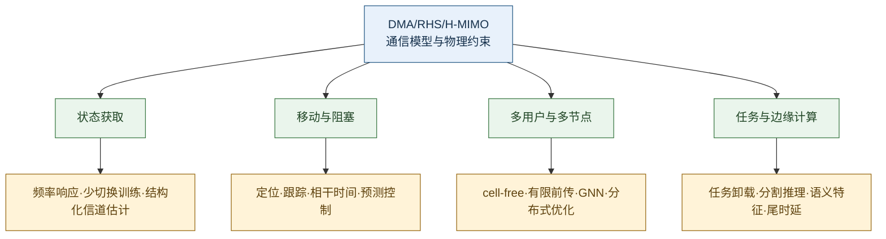

# AI Edge 赋能太赫兹 DMA/RHS 的文献地图与研究现状比较框架

本文档规定文献如何检索、筛选、比较和进入研究叙事。截至 2026-09-07，当前语料包含 39 篇研究论文、1 篇 AI Edge 基础资料和 2 份标准，共 42 条记录。2026-09-01 的四篇新增工作保留；2026-09-06 补入 Ruoyu Zhang 2025、Wang 2021 与指定版本的 3GPP TS 38.211，2026-09-07 补入 ITU-R P.676-13 作为大气吸收交叉校核依据。逐篇信息见 [literature_evidence_matrix.csv](literature_evidence_matrix.csv)，历史逐式对照见 [11 号文档](11_方向一深度调研与逐式模型对照.md)，频率响应与训练资源核对见 [12 号补核记录](12_方向一频率响应利用与训练开销补核.md)，Stage 0 仿真见 [13 号文档](13_方向一Stage0仿真设计与初步验证.md)。

## 1. 检索目的

检索不以统计文献数量为目标，而是回答三个问题：

1. 最近邻工作已经联合考虑了哪些通信与物理因素？
2. 新研究点增加的因素会在哪个具体场景改变结果？
3. 该差异能否在现有算力和纯仿真条件下被复现和证伪？

文献分为三类：直接研究 DMA/RHS/H-MIMO 的工作；研究太赫兹近场宽带、阻塞或边缘推理且可迁移到 DMA/RHS 的方法工作；定义 AI Edge 或提供基础通信模型的背景工作。

## 2. 检索树

## 3. 当前种子文献分布

| 方向 | 直接 DMA/RHS 工作 | 可迁移方法工作 | 核心精读顺序 |
|---|---|---|---|
| 1. 利用频率响应的宽带信道估计 | Ruoyu Zhang 2025、Deshpande、Carlson、Wang 2021、Gavras 2026、Yang、Xiangyu Zhang；Miao、Magalhães 等保留追踪 | Gao；Yue 与 Gavriilidis 用于专项扩展 | Ruoyu Zhang → Deshpande → Carlson；八篇主叙事名单见方向一 |
| 2. 预测式波束管理 | Gavriilidis、Stylianopoulos、Yang、Gavras | Kalør、Chafaa、Weng、Wang | Gavriilidis → Stylianopoulos → Kalør |
| 3. 分布式多用户控制 | Deng、Kimaryo、Zhang、Altinoklu、Zou、Chen、Du、Katsanos | 结构学习与 cell-free 方法按需补充 | Du → Katsanos → Zou；Deng 用于基础模型 |
| 4. 任务型边缘推理 | Geng、Wu、Zeng | Balevi、Shao、Xie、Huang、Stylianopoulos；另补 Stylianopoulos 等的 TWC 端到端边缘推理工作 | Geng → Balevi → Zeng；Stylianopoulos TWC 用于最近邻约束，Wu 用于完整应用参照 |

## 4. 最近邻工作比较

### 4.1 方向一

| 工作 | 已处理因素 | 剩余边界 | 对本方向的约束 |
|---|---|---|---|
| [Ruoyu Zhang@2025，TWC](https://doi.org/10.1109/TWC.2025.3551144) <!--ref:zhang2025tensorofdm--><!--anchor:section:II-III,VI--> | MIMO-OFDM、微带顺序训练、跨子载波张量 CE；Fig. 11 测试频变波导与互耦失配 | 主估计模型固定波导常数，未把完整单元频响用于少切换训练 | 少时域测量、多频结构恢复及失配误差地板均已有 |
| [Deshpande@2024，预印本](https://arxiv.org/abs/2412.00215) <!--ref:deshpande2026frequencyselective--><!--anchor:section:IV-B--> | 固定配置的单 OFDM 符号频率选择性波束训练；反馈所选子载波 | 远场角度/波束目标，数据中心频率随训练结果选择；无多径通信 CSI 恢复 | “用频率维度减少扫描”本身不新；固定业务频段与恢复目标须明确 |
| [Carlson@2025，预印本](https://arxiv.org/abs/2510.07827) <!--ref:carlson2026widebanddma--><!--anchor:section:II-III--> | 波导损耗、谐振频响、有限调谐和宽带增益 | 未研究通信获取成本 | 可实现响应和损耗应进入主基线，不能只做理想增益比较 |
| [Wang@2021，TCOM](https://www.weizmann.ac.il/math/yonina/sites/math.yonina/files/ADC.pdf) <!--ref:wang2021dmaofdmadc--><!--anchor:section:II--> | 频率选择性 DMA-OFDM 接收与低比特 ADC | 基于 CSI 设计数据接收器，不解决低导频 CE | 架构兼容已有基础；仍须满足 CP 与等效通道记忆条件 |
| [Gavras@2026，预印本](https://arxiv.org/abs/2604.11580) <!--ref:gavras2026widebandsensing--><!--anchor:section:II-IV--> | 上行 OFDM、现实宽带 DMA、FIM/EFIM 与有效信息带宽 | 远场感知，不给出本方向的通信估计与时序收益 | 普通下界不新；损耗可能抵消频域观测收益 |

当前研究问题是：在固定业务频段和同等资源条件下，真实 DMA 频响产生的多子载波观测能否替代部分时间扫描，并形成有效的信道估计与可实现训练设计。这是待验证的研究切入点，不以因素组合宣称创新。

Xiangyu Zhang 的 LISTA、Yang 的窄带近场估计和 Gao 的宽带近场展开作为补充方法基线。Yue、Gavras 2025 和 Gavriilidis 的近场/互耦分析保留为专项扩展；原来“近/混合场曲率与频散交互必须成立”的门槛已不再约束整个方向一。

### 4.2 方向二

| 工作 | 已处理因素 | 未处理因素 | 对本方向的约束 |
|---|---|---|---|
| [Gavriilidis@2025](https://arxiv.org/abs/2406.01488) | XL-DMA 近场移动、波束相干时间、动态搜索 | 未来阻塞概率和提前备份波束 | 反应式跟踪必须作为直接基线 |
| [Stylianopoulos@2023](https://arxiv.org/abs/2310.19767) | DMA 宽带响应、NLoS 位置估计、历史轨迹 | 多步链路控制和不确定度 | 位置网络本身不构成新增贡献 |
| [Kalør@2021](https://arxiv.org/abs/2106.07442) | 毫米波/太赫兹阻塞预测、跨场景少样本适应 | DMA/RHS 可实现状态和波束控制 | 阻塞预测必须进入配置决策 |

方向二的创新交集为：仅用通信侧观测预测阻塞与波束有效性，以校准不确定度触发主动探测，并提前配置物理可实现主备波束。

### 4.3 方向三

| 工作 | 已处理因素 | 未处理因素 | 对本方向的约束 |
|---|---|---|---|
| [Du@2025](https://doi.org/10.1109/TVT.2025.3584846) | 有限前传、近场、关联、压缩、DMA 波束、部分去中心化 | 非理想 CSI 下的完全分布式控制 | 一般“cell-free DMA 联合优化”已经不足 |
| [Katsanos@2026](https://arxiv.org/abs/2605.03538) | OFDM、非理想 CSI、少量交换、频响、互耦 | 端到端消息内容学习和跨拓扑复用 | 必须正面对比其解析交换机制 |
| [Zou@2025](https://doi.org/10.1109/TVT.2025.3544063) | 导频到多用户波束的 GNN、用户干扰关系 | 多节点有限比特协调 | 不能只把单站 GNN 搬到 cell-free |

方向三的创新交集为：显式协调比特与轮数预算、学习型量化消息、物理可行控制、拓扑和规模泛化、慢关联与快波束联合。

### 4.4 方向四

| 工作 | 已处理因素 | 未处理因素 | 对本方向的约束 |
|---|---|---|---|
| [Geng@2025](https://doi.org/10.1109/TCOMM.2025.3562524) | H-MIMO 任务比例、CPU、全息与数字波束、鲁棒 CSI | 中间特征、准确率和任务损失 | 一般任务卸载已经不足 |
| [Balevi@2026](https://doi.org/10.1109/TCOMM.2025.3650276) | 可配置切分、多任务统一图、数字/JSCC、信道适配 | 最优切分、太赫兹近场和 DMA/RHS 状态 | “增加可变切分点”不是创新 |
| [Zeng@2026](https://arxiv.org/abs/2606.20887) | 语义重要性、SNR、重建损失、RHS 波束 | 分割推理、GPU 竞争和尾时延 | 特征重要性需与切分和算力联动 |
| [Stylianopoulos@2026，TWC](https://arxiv.org/abs/2504.00233) | RIS/SIM 作为端到端分割推理网络的可训练物理层，含部署与信道适配 | 波导馈电 DMA/RHS、太赫兹近场宽带、最优切分和 GPU 资源 | “超表面参与端到端边缘推理”也已不是创新 |

方向四的创新交集为：物理可实现 DMA/RHS 状态、切分与特征保护、无线和边缘 GPU 分配、任务损失与尾时延联合优化。

## 5. 证据矩阵字段

每篇文献按以下字段记录：

| 字段 | 记录内容 |
|---|---|
| `scenario` | 上/下行、单/多用户、单站/cell-free、载频、带宽和近远场 |
| `surface_model` | DMA/RHS/SIM 类型、馈电结构、控制约束、频率响应和互耦 |
| `observation` | 导频、完整 CSI、有效 CSI、位置、业务和历史反馈 |
| `decision` | 信道估计、波束、关联、消息、任务切分或资源分配 |
| `method` | 优化、统计估计、展开网络、GNN、时序模型或强化学习 |
| `metrics` | NMSE、速率、训练开销、前传、时延、能耗和任务质量 |
| `key_result` | 可核对的主要结果及其适用设置 |
| `gap` | 该工作没有联合考虑、且会改变目标问题的因素 |
| `evidence` | 预印本、作者稿或正式全文的本地路径与 DOI |

## 6. 检索式模板

方向一：

- `("dynamic metasurface antenna" OR "reconfigurable holographic surface") AND channel estimation AND (wideband OR OFDM) AND (near-field OR terahertz)`
- `DMA AND (frequency selective OR waveguide OR resonance OR coupling) AND (pilot OR training OR estimation)`
- `"dynamic metasurface" AND ("single-shot" OR "frequency diversity" OR "tensor") AND (training OR "channel estimation")`
- `"Tensor-Based Channel Estimation for Extremely Large-Scale MIMO-OFDM"`
- `"Dynamic Metasurface Antennas for MIMO-OFDM Receivers With Bit-Limited ADCs"`
- `(deep unfolding OR model-based learning) AND terahertz AND near-field AND channel estimation`

方向二：

- `(DMA OR RHS OR holographic MIMO) AND (beam tracking OR mobility OR blockage prediction)`
- `terahertz AND near-field AND (beam coherence OR proactive beam management OR backup beam)`
- `(communication measurements OR CSI history) AND blockage prediction AND uncertainty`

方向三：

- `(DMA OR RHS) AND (cell-free OR distributed OR cooperative) AND multi-user`
- `(holographic MIMO OR DMA) AND (limited fronthaul OR quantized message OR decentralized beamforming)`
- `(graph neural network OR message passing) AND cell-free AND beamforming AND topology generalization`

方向四：

- `(DMA OR RHS OR holographic MIMO) AND (edge inference OR split computing OR task-oriented communication)`
- `terahertz AND (feature transmission OR semantic importance) AND edge computing`
- `(split inference OR early exit) AND (beamforming OR metasurface) AND tail latency`

正式选题前，应对核心文献执行前向引文、后向引文和同作者追踪，并把检索日期、数据库和筛选原因写入矩阵。方向一 2026-09-01 的检索式、纳入排除标准和反证结果已单独归档在 [11_方向一深度调研与逐式模型对照.md](11_方向一深度调研与逐式模型对照.md)。

## 7. 研究现状的写作方法

每个方向的研究现状按“场景—处理因素—方法—结果—剩余因素”组织。推荐句式为：

> 围绕某场景，[作者@年份，期刊]将某些物理或通信因素纳入模型，采用某方法优化某指标，结果表明某因素在某条件下造成某结果。该模型没有处理某项与本研究直接相关的因素。

一段聚合两至三篇处理同一问题的工作，段末给出具体边界。研究缺口直接写成可仿真的场景与效应，例如：“在室内太赫兹 OFDM 上行中，带宽边缘的谐振响应和球面波相位共同改变 DMA 观测矩阵，按频率不变模型训练的估计器会产生距离和时延偏差。”

## 8. 文献进入主叙事的标准

一篇文献进入方向正文，需要满足至少一项：定义直接系统模型；构成最近邻算法；提供关键物理因素；提供必须比较的性能界或基线。只有背景相关、没有可迁移模型或结果的文献留在证据矩阵，不进入主叙事。

三篇核心文献分别承担“系统模型、最近邻方法、关键缺口”三个角色。方向一当前分别为 Carlson、Ruoyu Zhang 2025、Deshpande；其技术判断按已经核对的公开全文版本表述。补充文献控制在五篇左右，用于覆盖宽带、近场、鲁棒性、网络或任务的相邻分支。
